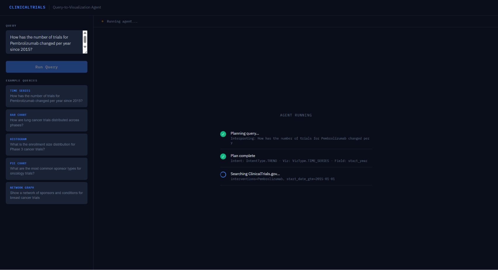
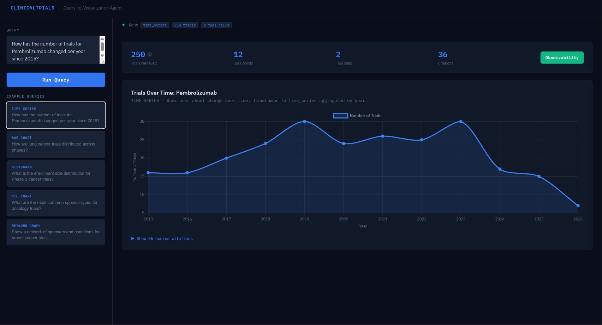
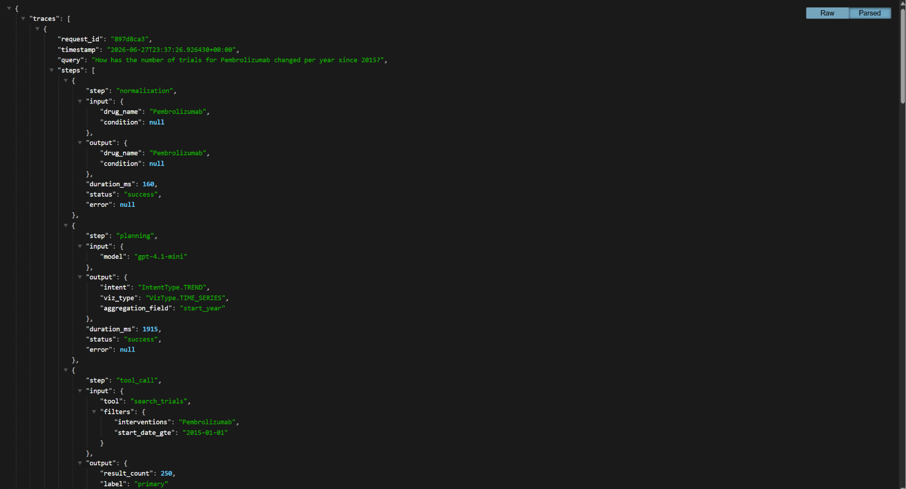
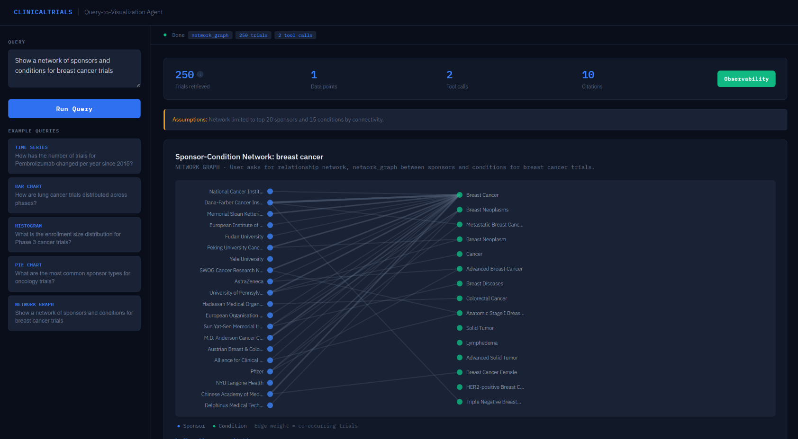
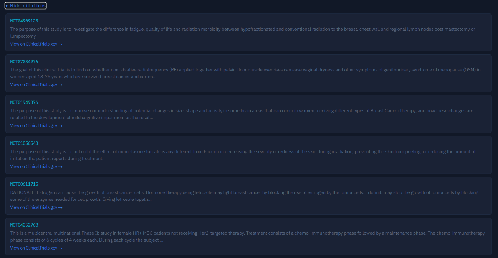

# ClinicalTrials Query-to-Visualization Agent

A FastAPI backend that converts natural language questions about clinical trials into structured visualization specifications, backed by real-time [ClinicalTrials.gov](https://clinicaltrials.gov/data-api/api) data. Includes a lightweight frontend UI with live streaming progress.

---

## How to Run

### Install

```bash
pip install -r requirements.txt
cp .env.example .env
# Edit .env and set OPENAI_API_KEY=your_key_here
```

### Start the server

```bash
# Live mode (hits real ClinicalTrials.gov API)
python -m uvicorn app.main:app --reload

# Mock mode (synthetic CT data, still uses real OpenAI API) - Made for initial pre UI testing to check if everything was working correctly
# PLEASE FEEL FREE TO IGNORE
MOCK_MODE=true python -m uvicorn app.main:app --reload
```

Server runs at `http://localhost:8000`. Docs at `http://localhost:8000/docs`.

### Open the frontend

Open `frontend/index.html` directly in your browser. No separate server needed.

### Run example queries

```bash
# With real data
python examples/run_examples.py

# With mock CT data
MOCK_MODE=true python examples/run_examples.py
```

---

## Request / Response Schema

### POST `/query`

Standard request/response. Returns the full visualization spec as JSON.

### POST `/query/stream`

Streaming version using Server-Sent Events. Emits live progress events during agent execution, then the final result. Used by the frontend UI.

### GET `/traces`
Returns all stored request traces. Each trace captures every step (normalization, planning, tool calls, assembly) with inputs, outputs, and timing. In production, forward to Datadog or CloudWatch via structured logging.

**Request**

| Field | Type | Required | Description |
|---|---|---|---|
| `query` | string | Yes | Natural language question about clinical trials |
| `drug_name` | string | No | Drug/intervention name hint — reduces LLM parsing burden |
| `condition` | string | No | Disease/condition hint |
| `trial_phase` | string | No | Phase filter (PHASE1-PHASE4, EARLY_PHASE1, NA) |
| `sponsor` | string | No | Sponsor organization name |
| `country` | string | No | Country filter |
| `start_year` | integer | No | Filter trials starting on or after this year |
| `end_year` | integer | No | Filter trials starting on or before this year |

**Example request**

```json
{
  "query": "How has the number of trials for Pembrolizumab changed per year since 2015?",
  "drug_name": "Pembrolizumab",
  "start_year": 2015
}
```

**Example response**

```json
{
  "visualization": {
    "type": "time_series",
    "title": "Trials Over Time: Pembrolizumab",
    "encoding": {
      "encoding_type": "cartesian",
      "x": { "field": "start_year", "label": "Year", "type": "temporal" },
      "y": { "field": "trial_count", "label": "Number of Trials", "type": "quantitative" }
    },
    "data": [
      {
        "start_year": "2015",
        "trial_count": 12,
        "citations": [
          {
            "nct_id": "NCT02362360",
            "excerpt": "Phase 2 randomized study evaluating pembrolizumab...",
            "field_name": "protocolSection.descriptionModule.briefSummary",
            "url": "https://clinicaltrials.gov/study/NCT02362360"
          }
        ]
      }
    ]
  },
  "meta": {
    "query_interpretation": "User asked about change over time, trend intent maps to time_series.",
    "filters_applied": { "drug_name": "Pembrolizumab", "start_year": 2015 },
    "total_trials_retrieved": 250,
    "assumptions": [],
    "tool_calls_made": 2,
    "source": "clinicaltrials.gov"
  },
  "plan": {
    "intent": "trend",
    "viz_type": "time_series",
    "aggregation_field": "start_year",
    "reasoning": "User asked about change over time, trend maps to time_series aggregated by year.",
    "requires_multiple_searches": false,
    "filters": { "drug_name": "Pembrolizumab", "start_year": 2015 }
  }
}
```

Full JSON schemas available at `/schema/request` and `/schema/response`.

---

## Supported Visualization Types

| Type | Intent | Example query |
|---|---|---|
| `time_series` | Trend | "How has the number of Pembrolizumab trials changed per year since 2015?" |
| `bar_chart` | Distribution / Geographic | "How are lung cancer trials distributed across phases?" |
| `grouped_bar_chart` | Comparison | "Compare phases for Pembrolizumab vs Nivolumab" |
| `histogram` | Enrollment distribution | "What is the enrollment size distribution for Phase 3 cancer trials?" |
| `pie_chart` | Proportional breakdown | "What are the most common sponsor types for oncology trials?" |
| `network_graph` | Relationships | "Show a network of sponsors and conditions for breast cancer trials" |

---

## Key Design Decisions

### 1. Three-stage pipeline: Plan, Tool Loop, Deterministic Assembly

Every request goes through three distinct stages. The LLM is only involved in stages 1 and 2. Stage 3 (assembling the VisualizationSpec) is deterministic Python code — the LLM never generates the final JSON schema. This prevents hallucinated field names and schema drift.

### 2. Forced planning step with strict JSON schema

Before any tool calls, the agent produces a validated AgentPlan using OpenAI's json_schema response format with strict: true. This constrains the LLM at the token level — intent can only be one of 6 exact strings, viz_type one of 7, aggregation_field one of 9. Invalid enum values are structurally impossible, not just filtered after the fact.

### 3. Few-shot examples in the plan prompt

The planning system prompt includes 5 concrete query to plan examples covering every intent type. The LLM pattern-matches against these rather than reasoning from scratch, which significantly reduces intent misclassification.

### 4. Retry-on-failure planning

If Pydantic validation fails on the plan output, the error message is sent back to the LLM with a re-prompt request before falling back to rule-based planning. One retry loop catches most edge cases without abandoning the LLM reasoning entirely.

### 5. Entity normalization before planning

Drug brand names and condition abbreviations are resolved to canonical forms before reaching the planner. "keytruda" becomes "Pembrolizumab", "T2D" becomes "type 2 diabetes". Uses a local dictionary for common cases and the ClinicalTrials.gov autocomplete API as a fallback. Eliminates synonym ambiguity at the source.

### 6. Raw OpenAI SDK, no framework

The agentic loop is implemented directly against the OpenAI chat completions API with explicit message history management. No LangChain or LangGraph. The loop is ~50 lines of code that are easy to reason about, debug, and extend.

### 7. Hard cap of 5 tool calls per request

The agent loop is bounded at MAX_TOOL_CALLS = 5. Every query type is answerable in 2-3 tool calls (search, aggregate, or search, search, aggregate for comparisons). The cap prevents runaway execution and ensures predictable latency.

### 8. Coarse-grained tools

Three tools: search_trials, aggregate, get_study_details. Coarse granularity means the LLM makes fewer decisions per request, each easier to validate. Fine-grained tools would give the LLM more surface area for invalid combinations.

### 9. Discriminated union encoding

VisualizationSpec.encoding is a Pydantic discriminated union on encoding_type: either CartesianEncoding (x/y/series) or NetworkEncoding (nodes/edges). A frontend can branch cleanly on encoding.encoding_type with full type safety.

### 10. Deep citations on every data point

Each aggregated data point includes up to 3 Citation objects with nct_id, text excerpt, field name, and URL. Citations come from actual API response text, never generated by the LLM.

### 11. Live streaming progress via SSE

The /query/stream endpoint uses Server-Sent Events to stream agent progress in real time. Each tool call emits a progress event (planning, searching, aggregating) that the frontend renders as a live step-by-step loading screen before the chart appears.

### 12. Performance-tuned CT API client

The ClinicalTrials.gov client uses requests (not httpx — the site blocks httpx via TLS fingerprinting) run in a thread pool executor to keep the async interface. Page size is capped at 250 with a single page fetch by default, balancing data quality against latency. The planning step uses gpt-4.1-mini for speed; the tool loop uses gpt-4.1.

---

## Tradeoffs

**Sample size vs latency:** I fetch 250 trials per search (1 page) rather than paginating to 1000+. This makes responses ~5x faster but means patterns are based on a sample. For most analytical questions 250 trials is sufficient to show the distribution; for rare conditions it may undercount.

**Coarse tools vs fine-grained:** Coarse tools limit partial aggregations and field-level filtering. Compensated with top_n and label params on aggregate.

**Deterministic assembly vs LLM-generated spec:** Loses flexibility for novel query types outside the intent taxonomy. Gains reliability and schema correctness.

**5-call cap:** Deeply nested comparison queries (3+ entities) cannot be fully explored.

**Single-pass planning with retry:** The plan is produced in one LLM call (with one retry on failure), not revised iteratively during execution. If both fail, the rule-based fallback kicks in.

---

## What I Would Improve With More Time

1. **Caching** — identical search params should cache CT API results for the session to avoid redundant network calls on repeated or similar queries.
2. **Plan revision after search** — after the first search returns results, a second LLM call could revise the plan based on what data was actually available, catching cases where the original intent was mismatched to the data.
3. **Choropleth map** — geographic trial density by country rendered on an actual map rather than a bar chart. Would need Leaflet or D3.
4. **Drug-drug co-occurrence network** — extending the network graph to show which drugs frequently appear together in combination studies.
5. **Structured logging with trace IDs** — each request should carry a trace ID through all log lines for debuggability in production.
6. **Dynamic histogram bucketing** — currently enrollment buckets are defined statically. Dynamic bucketing based on the actual data distribution would be more statistically meaningful.
7. **Add optional fields to UI** - currently the optional fields like drug name, start year etc. can only be passed into the API but there's no provision for the user to do that from the UI itself, I'd add that
8. **Add pagination to the UI** - right now, for performance issues I cap everything at the top 250 data points, I'd like to extend this allow the user to be able to see the entire thing (with some delay as the AI makes sense of things) or pagination to the UI so they can see 0-250, 251-500...
9. **Note for points 3, 4 and 8** - these are basically to say that I can add additional maps and better functionality to map making, I tried to keep everything within a certain MVP-esque scope for a 6 hour assignment
10. **Something to think about** -- a local trial database with scheduled sync — every query hits the ClinicalTrials.gov API live, adding 1-3 seconds of latency per request. A local PostgreSQL database synced nightly via cron would drop that to under 100ms — the biggest single performance win available.
Tradeoff: newly registered trials would show up with up to 24 hours delay. Acceptable for researchers doing analysis, not for patients searching for active recruiting studies.
11. **Cloud observability** — request traces are currently stored in-memory and exposed at `/traces`. In production these would be forwarded to Datadog or AWS CloudWatch via a structured logging sidecar, enabling dashboards, alerts, and cross-request search.

---

## AI Tools Used

- **OpenAI gpt-4.1 / gpt-4.1-mini** — used within the agent for query planning and tool orchestration
- **Claude (claude.ai)** — used as a coding assistant for help with development

### What I designed deliberately

- The three-stage pipeline architecture (plan, tool loop, deterministic assembly)
- The forced planning step as the primary hallucination guard
- Using strict JSON schema and few-shot examples to constrain LLM output at the token level
- The entity normalization step before planning to eliminate synonym ambiguity
- The retry-on-failure mechanism before falling back to rule-based planning
- The discriminated union encoding schema for frontend type safety
- The MAX_TOOL_CALLS bound and its justification
- Switching from httpx to requests after discovering TLS fingerprinting blocks

### How I validated correctness

- Pydantic validation on every input/output boundary
- Intent/viz_type compatibility check with rule-based fallback
- Direct unit tests on tool functions (aggregate, citations, enrollment bucketing)
- End-to-end tests against mock CT data before switching to live API
- Manual verification of all 6 visualization types against real ClinicalTrials.gov data